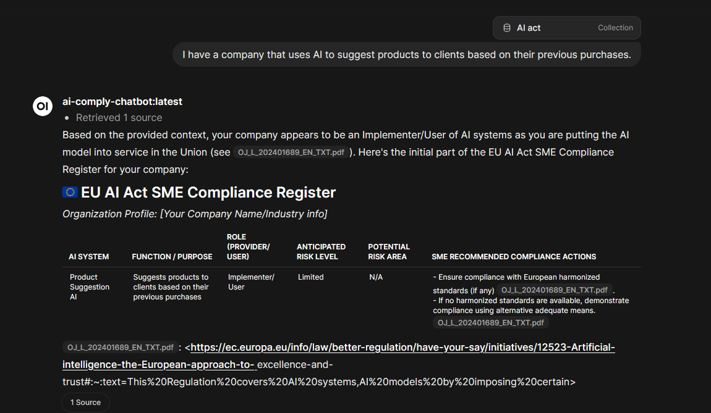

# AI chatbot thingy for course
---
**Setup:**
1. Rename .env.example to .env (in case of changing the model, also swap it in ai-comply-modelfile)
2. Docker compose up. (might take a while)
3. Create knowledge base from rag-documents, use the EMBEDDING_MODEL from .env. (Yet to automate that) 
4. When chatting use ai-comply-chatbot.

Proudly vibe configured with zero braincells used.

